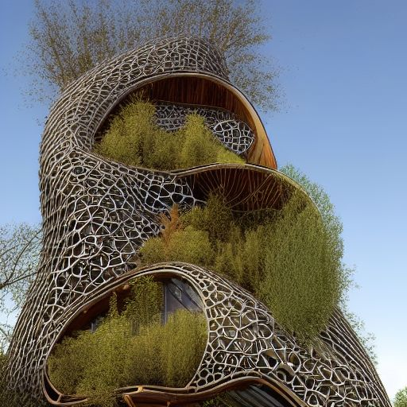

# awesome-sd-images
Collection of awesome Stable Diffusion generated images

## Architecture 

>```beautiful open kitchen in the style of elena of avalor overlooking aerial wide angle view of a solarpunk vibrant city with greenery, interior architecture, kitchen, eating space, rendered in octane, in the style of Luc Schuiten, craig mullins, solarpunk in deviantart, photorealistic, highly detailed, Vincent Callebaut, elena of avalor, highly detailed, –ar 16:9```


infinite hyperbolic intricate maze, futuristic eco warehouse made out of dead vines, glass mezzanine level, lots of windows, wood pallets, designed by Aesop, forest house surrounded by massive willow trees and vines, white exterior facade, in full frame, , exterior view, twisted house, 3d printed canopy, clay, earth architecture, cavelike interiors, convoluted spaces, hyper realistic, photorealism, octane render, unreal engine, 4k, –stylize 5000 –ar 1:2```
