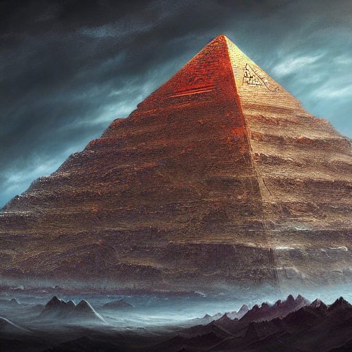

# awesome-sd-images
Collection of awesome Stable Diffusion generated images


>```beautiful open kitchen in the style of elena of avalor overlooking aerial wide angle view of a solarpunk vibrant city with greenery, interior architecture, kitchen, eating space, rendered in octane, in the style of Luc Schuiten, craig mullins, solarpunk in deviantart, photorealistic, highly detailed, Vincent Callebaut, elena of avalor, highly detailed, –ar 16:9```


>```infinite hyperbolic intricate maze, futuristic eco warehouse made out of dead vines, glass mezzanine level, lots of windows, wood pallets, designed by Aesop, forest house surrounded by massive willow trees and vines, white exterior facade, in full frame, , exterior view, twisted house, 3d printed canopy, clay, earth architecture, cavelike interiors, convoluted spaces, hyper realistic, photorealism, octane render, unreal engine, 4k, –stylize 5000 –ar 1:2```


>```a highly detailed epic cinematic concept art an alien pyramid landscape , art station, landscape, concept art, illustration, highly detailed artwork cinematic, hyper realistic painting```


>```a highly detailed epic cinematic concept art CG render digital painting artwork: dieselpunk steaming half man half robot. By Greg Rutkowski, Ilya Kuvshinov, WLOP, Stanley Artgerm Lau, Ruan Jia and Fenghua Zhong, trending on ArtStation, subtle muted cinematic colors, made in Maya, Blender and Photoshop, octane render, excellent composition, cinematic atmosphere, dynamic dramatic cinematic lighting, precise correct anatomy, aesthetic, very inspirational, arthouse```


>```tree house in the forest, atmospheric, hyper realistic, epic composition, cinematic, landscape vista photography by Carr Clifton & Galen Rowell, 16K resolution, Landscape veduta photo by Dustin Lefevre & tdraw, detailed landscape painting by Ivan Shishkin, DeviantArt, Flickr, rendered in Enscape, Miyazaki, Nausicaa Ghibli, Breath of The Wild, 4k detailed post processing, artstation, unreal engine –ar 9:16```
